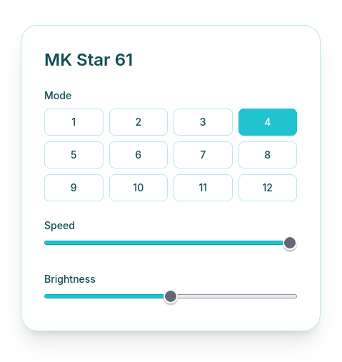

# MK Star 61 Lighting Control

A web app that lets you control the RGB lighting on a MageGee MK Star 61 mechanical keyboard mode, speed, and brightness instead of cycling through every mode one Fn-press at a time.

## How it works
The keyboard has a hidden USB channel that its lighting settings live on. This app talks to that channel directly, changes the settings, and sends them back
